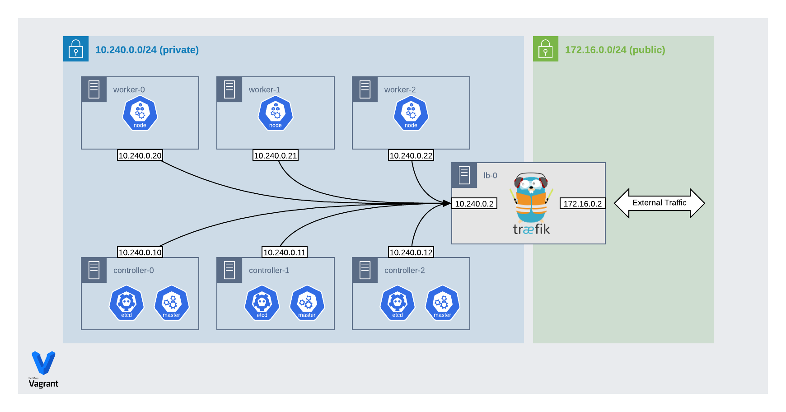

Kubernetes the Hard Way (Automated)
===

This project was a personal exercise to learn more about the internals of kubernetes. These ansible playbooks are derived from the steps in Keylsey Hightower's [Kubernetes the Hard Way](https://github.com/kelseyhightower/kubernetes-the-hard-way) tutorial.

> THIS IS NOT INTENDED FOR PRODUCTION USE.

One of the hardest parts of setting up kubernetes from scratch is the sheer number of certificates and configurations required to _just_ get the cluster up and running. I'm using ansible in order to automate the more tedious aspects of bootstrapping kubernetes, and I've replaced VMs and loadbalancer on GCP with vagrant and traefik running locally.

Requirements
---

These instructions have been tested on MacOS with `python3.6` but should work on other systems as well. It is assumed the following tools are already installed and available in your system's `PATH`:

* Vagrant - https://www.vagrantup.com/
* VirtualBox - https://www.virtualbox.org/
* Ansible - https://www.ansible.com/
* cfssl - https://cfssl.org/
* kubectl - https://kubernetes.io/docs/tasks/tools/install-kubectl/

> See `requirements.txt` for required python libraries

What's deployed?
---

|App|URL|
|---|---|
|Traefik Dashboard|https://traefik.example.local|
|whoami|https://apps.example.local/whoami|
|Kubernetes Dashboard|https://apps.example.local/dashboard/ _(the trailing slash is required)_|



> _the ip addresses shown above may not match your environment_

Setup
---

Vagrant requires the `vagrant-hostupdater` plugin to automatically manage entries in your `/etc/hosts` file for `lb.example.com` and `k8s.example.com`. The first time you run `vagrant up` it will ask to install the plugin if it hasn't already been installed.

```shell
# Install requirements (virtualenv recommended)
pip install --upgrade pip
pip install -r requirements.txt
ansible-galaxy install -r requirements.yaml

# Copy the example settings file and adjust to your needs
cp settings.example.yaml settings.yaml

# Setup local virtual machines
# NOTE: made need to run twice if this is the first time
vagrant up

# Run playbooks to bootstrap the cluster and deploy applications
ansible-playbook site.yaml

# set KUBECONFIG environment so you don't have to pass kubeconfig flag to kubectl
export KUBECONFIG=$(pwd)/local/admin.kubeconfig

# get dashboard token
kubectl -n kubernetes-dashboard describe secret $(kubectl -n kubernetes-dashboard get secret | (grep kubernetes-dashboard-token || echo "$_") | awk '{print $1}') | grep token: | awk '{print $2}'
```
